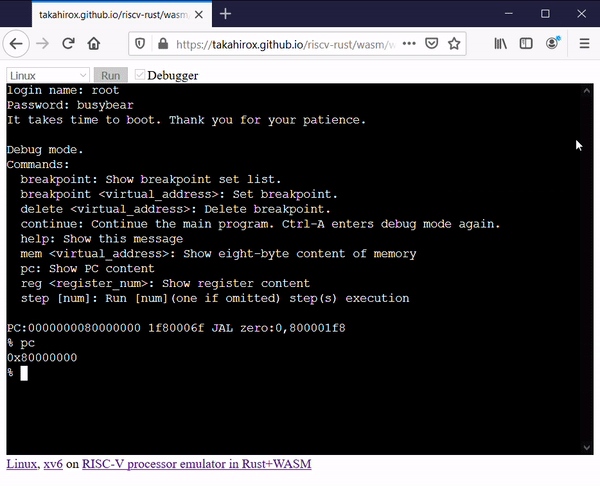

# Riscv-rust

Riscv-rust is a [RISC-V](https://riscv.org/) processor and peripheral
devices emulator project written in Rust and compilable to
WebAssembly.

This is a substantially enhanced fork of [Takahiro's riscv-rust
original emulator](https://github.com/takahirox/riscv-rust).  This
fork is already far more complete and is working towards near 100%
correctness.  Ultimately, we also expect it to become substantially
faster, but this work is delayed until this is sufficiently correct to
run benchmarks and off-the-shelf Linux distributions.

## Online Demo

You can run Linux on the emulator in your browser. [Online demo is
here](https://tommythorn.github.io/riscv-rust/wasm/web/index.html)

## Screenshots




## Documents

* [Document](https://docs.rs/riscv_emu_rust/0.2.0/riscv_emu_rust/)

## Features

- Emulate RISC-V RV64GC processor and peripheral devices (virtio block
  device and a UART)
- Boots Debian Trixie
- Stable as [Linux](https://risc-v-getting-started-guide.readthedocs.io/en/latest/linux-qemu.html) run on it
- Linux OpenSBI and legacy BBL boot support
- Runnable locally
- Also runnable in browser with WebAssembly
- Debugger
- You can import RISC-V emulator into your Rust or JavaScript project

## Instructions/Features support status

- [x] RV64IMAC
- [x] RV64FD (all-but fclass implemented, flags/rounding modes very lacking)
- [x] RV64Zifencei
- [x] RV64Zicsr
- [ ] RV64B
- [ ] Svnapot
- [x] CSR (almost?)
- [x] Sv39
- [x] Sv48 (untested, but should work)
- [x] Privileged instructions
- [ ] PMP (this is intensionally not implemented as it will negatively affect performance)

The emulator supports all instructions listed above but some 

## How to import into your Rust project

Add the following line into Cargo.toml of your Rust project.

```
[dependencies]
riscv_rust = { git = "https://github.com/tommythorn/rust-rust" }
```

Refer to [Document](https://docs.rs/riscv_emu_rust/0.2.0/riscv_emu_rust/struct.Emulator.html) for the API.

## How to build core library locally

```sh
$ git clone https://github.com/tommythorn/riscv-rust.git
$ cd riscv-rust
$ cargo build --release
```

## How to run Linux or xv6 as desktop application

```sh
$ cd riscv-rust/cli
# Run Linux
$ cargo run --release ../resources/linux/opensbi/fw_payload.elf -f ../resources/linux/rootfs.img
# Run xv6
$ cargo run --release ../resources/xv6/kernel -f ../resources/xv6/fs.img
```

## How to run riscv-tests

Prerequirements
- Install [riscv-gnu-toolchain](https://github.com/riscv/riscv-gnu-toolchain)
- Install [riscv-tests](https://github.com/riscv/riscv-tests)

```sh
$ cd riscv-rust/cli
$ cargo run $path_to_riscv_tets/isa/rv64ui-p-add -n
```

## How to import and use WebAssembly RISC-V emulator in a web browser

See [wasm/web](https://github.com/tommythorn/riscv-rust/tree/master/wasm/web)

## How to install and use WebAssembly RISC-V emulator npm package

See [wasm/npm](https://github.com/tommythorn/riscv-rust/tree/master/wasm/npm)

## Links

### Linux RISC-V port

[Running 64-bit RISC-V Linux on QEMU](https://risc-v-getting-started-guide.readthedocs.io/en/latest/linux-qemu.html)

### xv6-riscv

[xv6-riscv](https://github.com/mit-pdos/xv6-riscv) is the RISC-V port
of [xv6](https://pdos.csail.mit.edu/6.828/2019/xv6.html) which is UNIX
V6 rewritten by MIT for x86 in the current C language.

### Specifications

- [RISC-V ISA](https://riscv.org/specifications/)
- [Virtio Device](https://docs.oasis-open.org/virtio/virtio/v1.1/csprd01/virtio-v1.1-csprd01.html)
- [UART](http://www.ti.com/lit/ug/sprugp1/sprugp1.pdf)
- [CLINT, PLIC (SiFive E31 Manual)](https://sifive.cdn.prismic.io/sifive%2Fc89f6e5a-cf9e-44c3-a3db-04420702dcc1_sifive+e31+manual+v19.08.pdf)
- [SiFive Interrupt Cookbook](https://sifive.cdn.prismic.io/sifive/0d163928-2128-42be-a75a-464df65e04e0_sifive-interrupt-cookbook.pdf)
